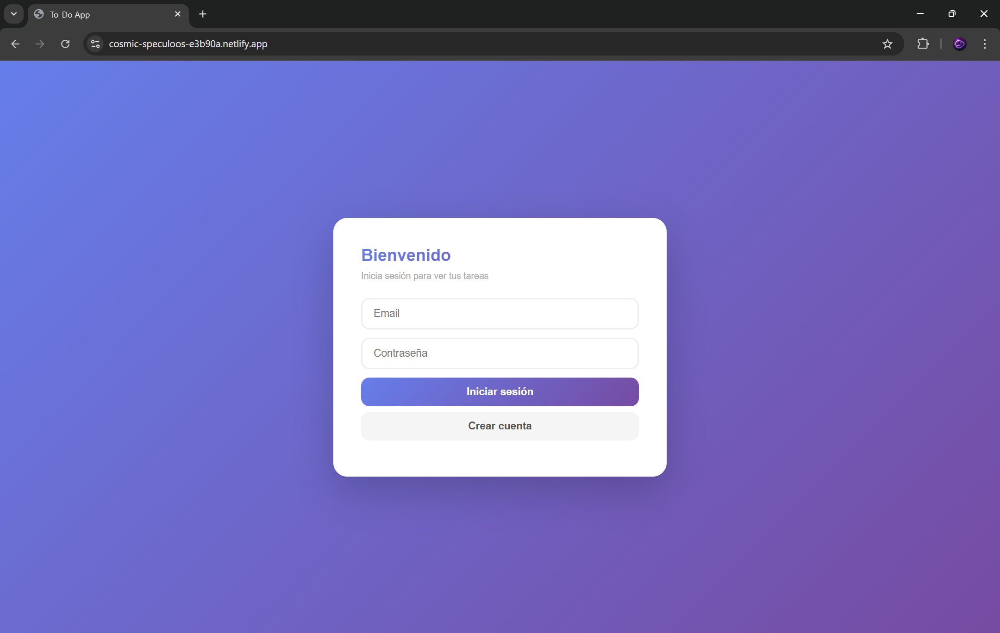
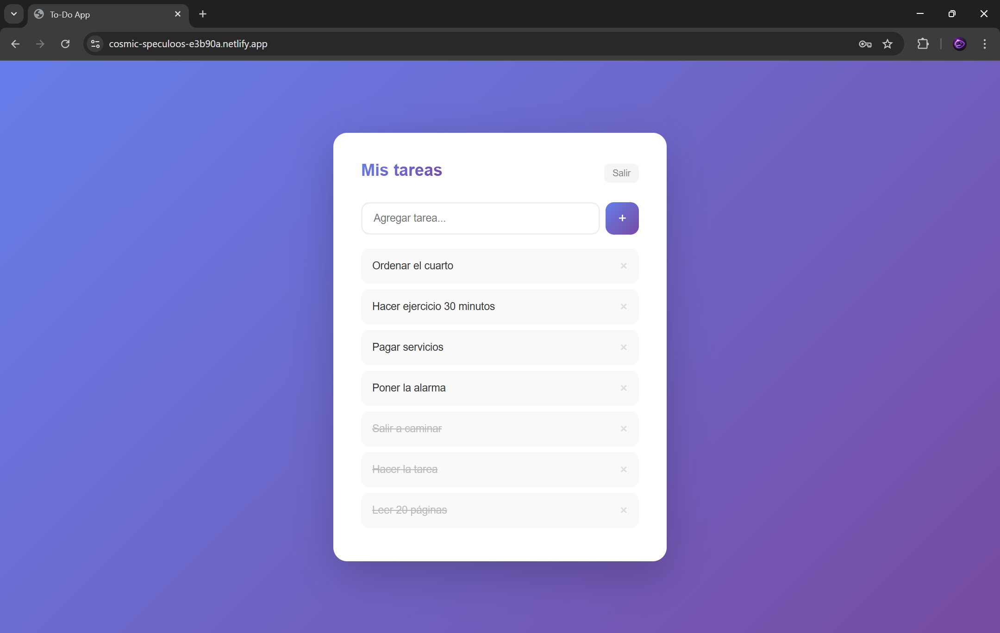

# To-Do App Full-Stack

App de tareas construida con Python y JavaScript.

## Tecnologías
- Backend: Python + FastAPI
- Frontend: HTML + CSS + JavaScript
- Base de datos: PostgreSQL (Neon)
- Deploy: Railway + Netlify

## Funciones
- Registro e inicio de sesión
- Agregar tareas
- Eliminar tareas
- Marcar tareas como completadas

## Demo
http://cosmic-speculoos-e3b90a.netlify.app

